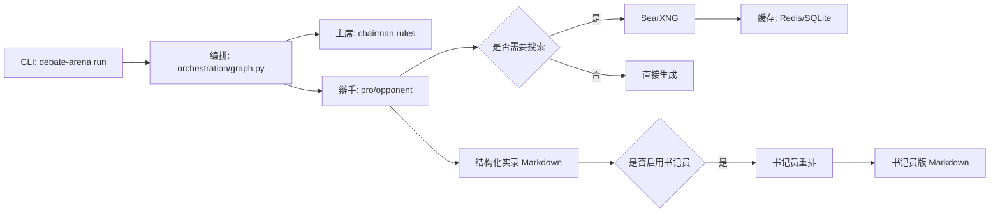

<p align="center">
  
</p>

# LogosX（Deep Agents 哲学辩论系统）

一个多 Agent 哲学辩论系统：主席负责强规则控场，正反双方扮演不同哲学家进行对抗性论证，并输出可复盘的中文 Markdown 辩论文档（默认 20+ 轮，含“书记员整理版”）。

## 目录

- [功能特性](#功能特性)
- [技术架构](#技术架构)
- [快速开始](#快速开始)
- [安装](#安装)
- [配置](#配置)
- [使用说明](#使用说明)
- [开发与测试](#开发与测试)
- [贡献指南](#贡献指南)
- [许可证](#许可证)
- [维护者与联系方式](#维护者与联系方式)

## 功能特性

- 多 Agent 协作：主席（Moderator/Chairperson）+ 正方辩手（西方哲学家）+ 反方辩手（东方哲学家）+ 书记员（文学化整理）
- 强规则控场：跑题警告、节奏提示、阶段总结、最终质量评估（主席不输出辩论观点）
- 结构化可复盘：先产出“结构化字段型”辩论实录，便于规则校验与分析
- 书记员整理版：在不改变论点与立场的前提下，进行段落重构、语气润色与少量舞台提示
- 搜索与缓存：支持通过 SearXNG 搜索，Redis 向量缓存 + SQLite 冷缓存（不可用时自动降级）

## 技术架构

**核心角色**

- 主席（Moderator/Chairperson）：强规则 + 弱生成，只负责控场、调度与评估
- 辩手（Debater）：强生成，必须回应对方并给出反驳与建设性论证，可按需搜索资料
- 书记员（Clerk）：仅将结构化字段重排为可读文本，禁止改动论点内容与逻辑

**模块划分（对应目录）**

- `debate_arena/cli.py`：CLI 入口（`debate-arena`）
- `debate_arena/orchestration/graph.py`：辩论编排与回合调度
- `debate_arena/agents/`：主席/辩手/书记员 Agent
- `debate_arena/search/`：SearXNG 客户端、Redis 向量缓存、SQLite 冷缓存、混合检索
- `debate_arena/document_manager.py`：Markdown 输出管理
- `config/`：规则、敏感词、哲学家角色、书记员规则（均为运行时动态加载）

**数据流（简化）**



## 快速开始

**前置条件**

- Python 3.11+
- 推荐使用 [uv](https://github.com/astral-sh/uv) 管理依赖与运行
- 可选但推荐：Docker（用于启动 SearXNG）、Redis Stack（用于向量缓存）

**1）准备环境变量**

- 复制 `.env.example` 为 `.env`
- 至少填写一个 LLM Provider 的 `*_API_KEY`（默认优先使用 `XIAOMIMIMO_API_KEY`）

**2）直接运行（uv）**

```bash
uv run debate-arena run --motion "德性即知识是否成立？" --pro-topic "德性即知识成立" --opp-topic "德性不等于知识" --rounds 20 --west guy_debord --east zhuangzi
```

**3）查看输出**

默认写入 `outputs/`：

- `辩论_YYYYMMDD_HHMMSS.md`：结构化实录（便于复盘与规则校验）
- `辩论_YYYYMMDD_HHMMSS_书记员版.md`：书记员整理版（更适合阅读）

## 安装

### 方式 A：使用 uv（推荐）

在项目根目录：

```bash
uv venv
uv pip install -e .
```

然后运行：

```bash
uv run debate-arena run --topic "何为善？" --rounds 2
```

### 方式 B：使用 pip（不推荐，但可用）

本项目依赖 `sentence-transformers`，安装时可能会拉取较大的深度学习依赖（例如 `torch`）。如果你更偏好可控环境，建议使用 uv。

```bash
python -m venv .venv
.\.venv\Scripts\activate
pip install -e .
debate-arena run --topic "何为善？" --rounds 2
```

## 配置

### 环境变量（.env）

`.env.example` 提供了模板。运行前至少需要配置一个 Provider 的 API Key。代码当前按顺序尝试：`XIAOMIMIMO` → `DEEPSEEK` → `NVIDIA` → `OPENROUTER`。

- `XIAOMIMIMO_API_KEY` / `XIAOMIMIMO_BASE_URL` / `XIAOMIMIMO_MODEL`
- `DEEPSEEK_API_KEY` / `DEEPSEEK_BASE_URL` / `DEEPSEEK_MODEL`
- `NVIDIA_API_KEY` / `NVIDIA_BASE_URL` / `NVIDIA_MODEL`
- `OPENROUTER_API_KEY` / `OPENROUTER_BASE_URL` / `OPENROUTER_MODEL`

### 搜索与缓存（可选但推荐）

- SearXNG：用于网页检索（仓库提供 `searxng-docker/`）
- Redis Stack：用于向量缓存与语义检索（不可用时自动降级）

启动 SearXNG（可选）：

```bash
cd searxng-docker
docker compose up -d
```

确保 `.env`：

- `SEARXNG_BASE_URL=http://localhost:8081`

确保 `.env`（Redis 可选）：

- `REDIS_URL=redis://localhost:6379/0`

## 使用说明

### CLI 命令

运行辩论：

```bash
uv run debate-arena run --motion "自由是否必须以责任为代价？" --pro-topic "自由必以责任为代价" --opp-topic "自由不必以责任为代价" --rounds 20
```

常用参数：

- `--motion`：本次议题/总辩题（中文）；也可用兼容参数 `--topic`
- `--pro-topic`：正方议题/立场（中文）。未提供会在启动时询问
- `--opp-topic`：反方议题/立场（中文）。未提供会在启动时询问
- `--rounds`：轮次数（默认 20）
- `--west`：西方哲学家角色文件名（不含扩展名），例如 `guy_debord`
- `--east`：东方哲学家角色文件名（不含扩展名），例如 `zhuangzi`
- `--output`：指定输出 Markdown 文件路径
- `--clerk-output`：指定书记员版输出路径（不填则自动追加 `_书记员版`）
- `--no-clerk`：只输出结构化实录，不生成书记员整理版

### 辩论赛制（固定四阶段）

系统会按四阶段编排：开篇立论 → 攻辩/质询 → 自由辩论 → 总结陈词（反方先总结、正方最后发言）。

更详细说明：

- `docs/使用指南.md`
- `docs/部署指南.md`
- `docs/示例输出.md`

## 开发与测试

### 本地开发

```bash
uv venv
uv pip install -e .
```

### 运行测试

当前测试使用标准库 `unittest`：

```bash
uv run python -m unittest
```

## 贡献指南

欢迎提交 Issue 与 PR。建议流程：

1. Fork 本仓库并创建特性分支：`feature/<topic>` 或 `fix/<bug>`
2. 变更尽量保持小而清晰：一个 PR 解决一个问题
3. 运行测试：`uv run python -m unittest`
4. 提交 PR 时描述清楚：动机、实现方式、验证方式、可能的兼容性影响

代码规范（约定优先，保持 KISS）：

- Python 3.11+，尽量使用类型标注与 `dataclass`
- 避免引入新的重型依赖；优先复用现有模块
- 不要在代码/日志/提交记录中包含任何密钥或隐私信息（`.env` 已在 `.gitignore` 中忽略）
- 规则与角色优先用 `config/*.yaml` 表达，减少硬编码

## 许可证

本项目基于 [MIT 许可证](LICENSE) 开源。详细信息请参阅 `LICENSE` 文件。

## 维护者与联系方式

- 维护者：DaoXuan (daoxuan7021@gmail.com)
- 主要沟通渠道：GitHub Issues / Discussions
- 安全相关问题：通过邮件联系维护者后再公开披露
